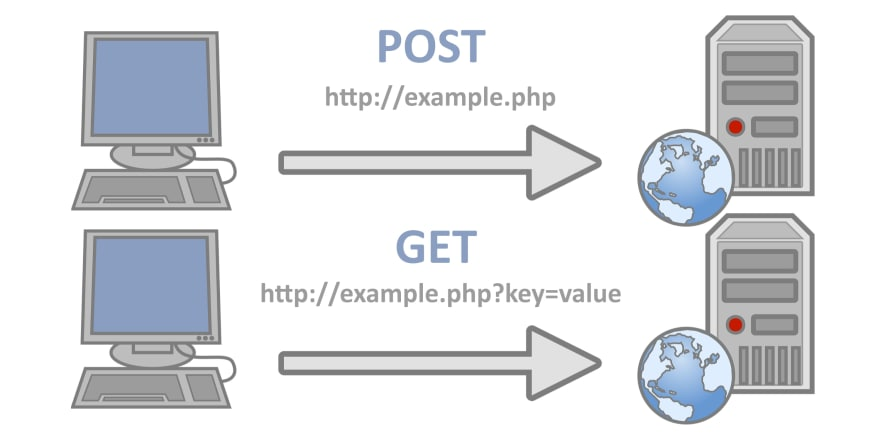

## 스프링 프레임워크 첫걸음 책 CH02

**아래 글은 스프링 프레임워크 첫걸음 책을 기반하여 작성한 글입니다.**

## 인터페이스


> 인터페이스는 추상 메서드만을 가질 수 있고 구현메서드는 가질 수 없는 일종의 추상 클래스이다.

### 인터페이스의 역할은?

- 인터페이스는 객체를 어떻게 구성해야 하는지 정리한 설계도이다.
- 인터페이스는 객체의 다형성을 높여준다.
- 인터페이스는 변수에 인터페이스가 구현된 서로 다른 구현 객체를 할당해 사용이 가능하다.
- 구현 객체를 직접 몰라도 인터페이스 메서드만 알아도 객체 호출이 가능하게 한다.


### 인터페이스의 특징

- 다중 상속 가능
    - 자식 클래스가 여러 부모 인터페이스들을 상속받을 수 있다.
- 추상 메서드만 보유
    - 인터페이스는 추상 메서드만 가지고 있다.
- 생성자를 생성하지 못한다.
    - 디폴트 생성자, 인자 있는 생성자 모두 생성이 불가능하다.
- 메서드 오버라이딩 필수
    - 자식클래스는 부모 인터페이스의 함수를 모두 오버라이딩해야 한다.

### 코드로 보자

```java
public interface Greet {

    /**
     * 인사
     */
    void greeting();
}


public class MorningGreet implements Greet {

    @Override
    public void greeting() {
        System.out.println("좋은 아침입니다.");  
    }
}
```
위 코드를 보고 생각해야 할 것이 있다.
1. `추상클래스` 가 들어가야 하는데 void greeting();이라고 선언하였다. 실은 암묵적으로 인터페이스에 함수를 선언하게 되면 `public abstract`가 앞에 붙게 되어서 그런것이다. 동일한 경우로 interface에 변수를 선언하면 앞에 `public static final`이 자동으로 붙게 된다.
2.  `@Override`가 붙으면 메서드를 재정의한 것을 의미한다.
3. `implements`라는 키워드를 통하여서 인터페이스를 구현한다.

---    

## 컬렉션


우리는 자바에서 생각해보면 배열이라는 친구도 있는데 따로 컬렉션 프레임워크라는 것이 존재하고 되도록이면 그것을 사용한다. 왜 그럴까?

### 배열을 사용했을때의 문제점

- 크기가 고정적이다.
    - 그렇기에 그 크기를 넘어가게 저장을 할 시 데이터를 저장할 수 없다.
- 데이터를 삭제할 시 해당 인덱스의 데이터가 비어있지만 메모리가 낭비되고 있다.

등등의 문제가 존재하기에 그래서 컬렉션 프레임워크를 사용하여 널리 알려진 자료구조 바탕으로 하여 객체나 데이터들을 효율적으로 관리(추가, 삭제, 검색, 저장) 할 수 있는 자료구조들을 만들어 놓게 되었다.

### 종류(인터페이스)

- List : 순서대로 데이터를 저장, 데이터의 중복을 허용
    - 구현 클래스 : ArrayList, Vector, Stack, LinkedList 등등
- Set : 순서를 유지하지 않는 집합, 중복을 허용하지 않는다.
    - 구현 클래스 : HashSet, TreeSet 등
- Map : key - value 형식으로 저장을 한다.
    - 구현 클래스 : HashMap, Hashtable, TreeMap, Properties 등등
- Queue : 데이터를 일시적으로 쌓아두기 위한 자료구조 중 하나로 선입선출(FIFO, First-In-First-Out)의 특성으로 가장 먼저 추가된 데이터가 가장 먼저 삭제되는 구조이다.


일단 책에서 설명한 내용인 List에 대해서 자세히 알아보자.


### ArrayList


> ArrayList는 List 인터페이스를 구현한 클래스로, 컬렉션 프레임워크에서 가장 많이 사용되는 컬렉션 클래스이다.

### ArrayList의 특징

- 요소를 배열로 저장하기에 검색이 빠르다.
- 요소의 수가 많아지면 추가/삭제를 하는데 시간이 걸린다.


### LinkedList


> LinkedList는 불연속적으로 저장된 데이터를 서로 연결한 형태로 구성된 자료구조이자 컬렉션이다.

### LinkedList의 특징

- 요소끼리 전후 양방향의 링크로 참조하는 리스트 구조를 이용해 관리한다.
- 그렇기 때문에 요소의 추가나 삭제가 ArrayList보다 빠르다.
- 검색과 같은 인덱스 값에 의한 무작위 액세스에는 적합하지 않다.


### ArrayList vs LinkedList

| 컬렉션        | 읽기 (접근시간) | 추가/삭제 | 비고                               |
|------------|-----------|-------|----------------------------------|
| ArrayList  | 빠르다       | 느리다   | 순차적 추가삭제는 더 빠르다. 메모리를 비효율적으로 쓴다. |
| LinkedList | 느리다       | 빠르다   | 데이터가 많을수록 접근성이 떨어진다.             |


### 선언예시

```java
List<String> names = new ArrayList<>();
```

보통 이런식으로 선언을 하는데 `<String>`인 곳을 List에 넣을 수 있는 형태를 제한하는 `제네릭`이라고 부른다. 

---

## 클라이언트 서버


> 클라이언트 서버는 두 개의 컴퓨터 프로그램 사이에 이루어지는 역할 관계를 의미한다.
> - 클라이언트 : 서비를 요청하는 쪽
> - 서버 : 서비스를 제공하는 쪽


## 브라우저

> 브라우저 : 인터넷을 이용할 때 사용하는 소프트웨어이다.
> 
> 브라우저 예시
> - 구글 크롬
> - 파이어 폭스
> - 마이크로소프트 엣지
> - 인터넷 익스플로러
> - 사파리
> - 등등

---

## 애플리케이션 웹 애플리케이션

> - 애플리케이션 : 응용 소프트웨어의 약어이다. -> 프로그래밍 언어로 작성한 소프트웨어이다.
> - 웹 애플리케이션 : 인터넷을 통해 사용되는 응용 프로그램이다. -> 검색 엔진, e-커머스, e-러닝 등등

---

## 웹 서버, WAS


### 웹 서버

- HTTP 기반으로 동작한다.
- 정적 리소스, 기타 부가기능
  - 정적 리소스란(파일) HTML, CSS, JS, 이미지, 영상 이런 종류들을 말한다.
- ex) NGINX, APACHE

### WAS(웹 애플리케이션 서버)

- HTTP 기반으로 동작
- 웹 서버 기능 + (정적 리소스 제공 가능)
- 프로그램 코드를 실행해서 애플리케이션 로직이 수행 가능하다.
  - 동적 HTML, HTTP API(JSON)
  - 서블릿, JSP, 스프링 MVC
- ex) 톰캣(Tomcat),Jetty, Undertow


### 그래서 두 개의 차이는?

애플리케이션 코드를 제공한다면 그것은 WAS
> 자바에서는 서블릿 컨테이너 기능을 제공하면 WAS라고 부른다.

---

## HTTP 통신(프로토콜)


> 클라이언트와 웹 서버는 HTTP 요청(request), HTTP 응답(response)로 사호작용한다. 이것을 HTTP 통신이라고 한다.

큰 흐름은 다음과 같다.

1. 클라이언트가 브라우저에 URL을 입력한다.
2. 클라이언트에서 웹 서버로 HTTP 요청이 전송된다.
3. 웹 서버는 HTTP 요청을 받아 HTTP 요청에 해당하는 HTTP 응답을 클라이언트에게 반환한다.
4. 브라우저는 받은 응답을 표시하고 클라이언트가 이를 확인한다.

### HTTP의 특징

- 클라이언트 서버 구조
  - 클라이언트 서버를 나눠서 서버에서 독립적으로 로직과 데이터를 처리할 수 있다.
- 무상태성
  - stateless라고도 말을 하는데 즉, 상태를 저장하지 않는다고 한다.
  - 장점 : 서버의 확장성이 높다.
  - 단점 : 클라이언트 추가 데이터 전송
  - 이 부분은 즉 계속 요청을 보낼때마다 새로운 요청을 보내는 것처럼 계속 해야하는 방식이다. 상식적으로 문맥만 보면 너무 비효율적인것처럼 보이지만 예를들어 서버가 중간에 터지거나 하게 되면 stateful한 방식으로 통신했을때는 한 서버에 의존적인 상황이 발생하기 때문에 서버를 확장하기가 되게 어려워진다. 그래서 stateless한 방식을 사용하기로 했다.
- 비연결성
  - 요청을 한 후 응답을 받으면 바로 연결을 종료한다. → 즉, 불필요한 연결을 하지 않아 서버 유지 자원이 감소하는 것이다.
→ 서버 유지 자원을 효율적으로 사용 가능하다.
- 단순 확장 기능
  - 위의 특징들 덕분에 HTTP는 단순하면서 확장을 쉽게 할 수 있어서 크게 성장할 수 있었다.

---


## GET 메서드와 POST 메서드




### GET

> GET method는 클라이언트에서 서버로 어떠한 리소스로부터 정보를 요청하기 위해 사용되는 메서드입니다.

데이터를 읽거나, 검색하는데 사용하는 method라고 생각하면 될 거 같다. 

**GET은 요청을 전송할 때 URL 주소 끝에 파라미터로 포함되어 전송되며, 이 부분을 쿼리 스트링(QueryString)이라고 부른다.**
>e.g.) www.example-url.com/resources?name1=송유현&name2=곽철용위 예는 앞서 말한 쿼리스트링을 포함한 URL이다. 파라미터인 name1과 name2를 통해 값을 전달받을 수 있습니다.
>만약, 요청 파라미터가 여러 개이면 &로 연결한다.

#### 부가적인 특징
- GET은 불필요한 요청을 제한하기 위해 요청이 캐시 될 수 있다.
-  파라미터에 내용이 노출되기 때문에 민감한 데이터를 다룰 때 GET 요청을 사용해서는 안 된다.(주민등록번호, id, 비밀번호 등)
-  GET 요청은 브라우저 기록에 남는다.
-  GET 요청을 북마크에 추가할 수 있다.
-  GET 요청에는 데이터 길이에 대한 제한이 있다.
-  Get 요청은 성공 시, 200(Ok) HTTP 응답 코드를 XML, JSON뿐만 아니라 여러 데이터(html, txt 등..), 여러 형식의 데이터와 함께 반환한다.
-  GET 요청은 idempotent 하다.


### POST

> POSTmethod는 리소스를 생성/업데이트하기 위해 서버에 데이터를 보내는 데 사용된다.

POST는 GET과는 다르게 request body에 값을 담아서 보내게 된다. 이렇게 되면 GET과는 다르게 URL에는 보이지 않게 리소스를 보내게 된다. 

그리고 GET과는 다르게 길이의 제한 없이 데이터를 전송할 수 있다.

#### 부가적인 특징
- POST 요청은 캐시 되지 않는다.
- POST 요청은 브라우저 기록에 남아 있지 않다.
- POST 요청을 북마크에 추가할 수 없다.
- POST 요청에는 데이터 길이에 대한 제한이 없다.
- Post 요청 중 자원 생성은 201(Created) HTTP 응답 코드를 반환한다.
- Post 요청은 idempotent하지 않다.


> idempotent : 멱등 이라는 뜻이며 똑같은 요청을 계속 했을때 값이 똑같이 나오면 멱등하다고 표현한다.

### GET vs POST

보통 이런 주제로 질문들이 많이 나오는데 그럼 차이는 어떤것일까?

일단 영어 뜻부터 다르다. GET은 받는다, POST은 보낸다의 의미가 있다. 

흔히 나오는 예제로는 `브라우저의 즐겨찾기에 등록할 수 있는가?` 에 대한 예로 자주 설명을 한다.


#### GET

GET에서는 URL에 연결해 송신하기 때문에 '즐겨찾기'에 등록하는 URL 자체에 쿼리 스트링으로 검색 데이터를 포함할 수 있다.

#### POST
POST에서는 검색 데이터를 요청 본문에 저장하기 때문에 '즐겨찾기'에 등록할 수 없다. POST로 요청을 보내려면 HTML의  `<form>`태그 속성의 method=POST 를 지정해야 한다.

그래서 브라우저의 즐겨찾기에서 URL에 액세스하는 것으로는 GET 메서드로 요청을 보낸다. 

---


## Lombok

>Lombok(롬복)은 Java 라이브러리로 반복되는 getter, setter, toString 등의 메서드 작성 코드를 줄여주는 코드 다이어트 라이브러리입니다.

코드를 작성하는데 도와주는 라이브러리라고 생각하면 좋을 거 같다.

---

## Gradle


> Gradle은 빌드 도구이다. 

빌드 도구가 뭘까?
- 필요한 라이브러리를 리포지토리(라이브러리가 저장되어 있는 곳)에서 다운로드한다.
- 소스코드를 컴파일한다.
- 테스트를 실행하여 보고서를 출력한다.
- 클래스 파일을 아카이브(여러 파일이나 폴더를 하나로 정리하는 것)을 생성한다.
- 아카이브를 스테이징 환경(프로덕션 환경에 가까운 환경)등에 배포한다.

위와 같은 설정들을 gradle이 지원해준다.