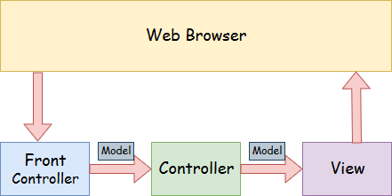
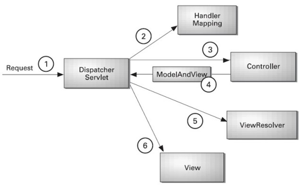

# Spring MVC 알아보기

## MVC 모델이란?

> MVC 모델이란 `프로그램의 처리 역할을 나누어서 프로그램을 작성하는 방법` 이라고 흔히 부른다.
> - M(Model)
> - V(View)
> - C(Controller)

풀어서 구체적으로 말하자면,

- MVC( Model -View-Controller)는 애플리케이션을 모델 , 뷰 및 컨트롤러의 세 가지 주요 논리적 구성 요소로 분리하는 아키텍처 패턴이다.
- 이러한 각 구성 요소는 애플리케이션의 특정 개발 측면을 처리하도록 구축되었다.
- MVC는 확장 가능하고 확장 가능한 프로젝트를 만들기 위해 가장 자주 사용되는 산업 표준 웹 개발 프레임워크 중 하나이다.


### Model

> 모델은 시스템에서 비즈니스 로직을 담당한다.

흔히 이렇게들 다들 말하곤 한다. 여기서 그러면 `비즈니스 로직` 이라고 부르는 친구에 대해서만 이해하면 모델은 바로 이해할 거 같다.

### 비즈니스 로직

비즈니스 로직이라는 것은 예시가 있으면 좋을 거 같아서 `회원가입` 이라는 예시를 들어본다.

회원가입을 하려고 할 때 필요한 것은 무엇일까? 
- 아이디의 중복확인
- 본인 인증
- 비밀번호 규칙 확인

이 있을 것이다. 이 중에서 아이디의 중복 확인의 비즈니스 로직을 생각해 보면 사용자가 입력한 아이디 값을 메모리에 저장, 회원 DB에서 같은 아이디가 있는지 확인, 중복 여부를 화면에 표시할 수 있게 전달하는 이런 것들을 `비즈니스 로직`이라고 부른다.

**즉, 하나의 핵심적인 시스템의 목적에 맞게 처리하는 부분** 이라고 이해하면 된다. 

**그러면 모델은 자동적으로 시스템에서 제공하는 비즈니스 로직의 처리 내용을 작성하는 곳이라고 생각하면 된다!**


### View

> 뷰는 외형이다.

사용자의 입력과 결과 출력 등 시스템에서 표현 부분을 담당하고 웹 애플리케이션에서는 주로 화면을 담당하게 된다.


### Controller

> 컨트롤러는 서비스 처리를 담당하는 모델과 화면 표시를 담당하는 뷰를 제어(Control)하는 역할을 한다.


사용자가 입력한 내용을 뷰에서 받고, 받은 데이터를 기준으로 모델에 내용을 전달한다. 모델에서 받은 데이터를 뷰에 전달해서 화면에 표시하는 역할을 한다.


### MVC 모델의 이점


그래서 이 그림처럼 서로 상호작용을 하는 것이다. 이런 구조를 가지면 어떤 이점들이 있을까?

1. 역할 분담을 통해 효율적인 개발 가능
2. 개발하는 엔지니어의 분업화 용이
3. 설계 변경에 유연하게 대응 가능


## Spring MVC 알아보기


### Spring MVC가 뭔데?

> Spring MVC는 웹 애플리케이션을 구축하는 데 사용되는 Java 프레임워크다. Model-View-Controller 디자인 패턴을 따른다. Inversion of Control, Dependency Injection과 같은 핵심 스프링 프레임워크의 모든 기본 기능을 구현한다.

우리가 알고 있는 MVC 모델 + Spring에서의 기본 기능들을 구현한 것을 Spring MVC라고 표현하는 거 같다. 

그런데 가장 큰 핵심은 어찌보면 다음과 같은 그림을 이해하는 것이다.



이 구조로 크게 이루어져있는데 갑자기 `Controller` 앞에 `FrontController`가 있다. 

이런 구조를 `Front Controller 패턴`이라고 부른다. 

> Front Controller 디자인 패턴은 모든 요청이 단일 처리기에 의해 처리되도록 중앙 집중식 요청 처리 메커니즘을 제공하는 데 사용됩니다.

이렇다고 하는데 즉, 모든 요청에 대해서는 앞단에서 Front Controller가 받은 후에 담당하는 Controller에게 전달하는 방식의 설계이다.


### Spring MVC의 주요 구성 요소



다음과 같이 진행이 되어진다. 

1. Dispatcher Servlet에서 모든 요청을 받는다.
2. HandlerMapping에 의해서 해당에 알맞는 담당 Controller를 배정한다.
3. 요청에 해당하는 Controller에서 작업을 수행 후 ModelAndView객체를 통해 View로 전달하기 위해 Dispatcher Servlet에 던져준다.
4. ViewResolver가 Controller의 처리 결과를 생성할 View를 결정
5. 컨트롤러의 처리 결과 화면을 생성, 템플릿 파일등을 View로 사용

간단한 흐름으로 봤을때 다음과 같은 과정이 이어진다.

### 구성요소에 대해서 간단히 개념으로서만 정리하자면

- DispatcherServlet : 클라이언트의 요청을 전달받아 요청에 맞는 컨트롤러가 리턴한 결과값을 View에 전달하여 알맞은 응답을 생성
- HandlerMapping : 클라이언트의 요청 URL을 어떤 컨트롤러가 처리할지 결정
- Controller : 클라이언트의 요청을 처리한 뒤, 결과를 DispatcherServlet에게 리턴
- ModelAndView : 컨트롤러가 처리한 결과 정보 및 뷰 선택에 필요한 정보를 담음
- ViewResolver : 컨트롤러의 처리 결과를 생성할 뷰를 결정
- View : 컨트롤러의 처리 결과 화면을 생성, 템플릿 파일 등을 뷰로 사용


### 예시를 통한 실습

### 📂HelloViewController
```java
package com.example.MVC_SAMPLE.Controller;

import org.springframework.stereotype.Controller;
import org.springframework.web.bind.annotation.GetMapping;
import org.springframework.web.bind.annotation.RequestMapping;
@Controller 
@RequestMapping("hello")
public class HelloViewController {
    @GetMapping("view")
    public String helloView(){
        return "hello";
    }
    
}
```

### 📂hello.html
```html
<!doctype html>
<html lang="en">
<head>
  <meta charset="UTF-8">
  <meta name="viewport"
        content="width=device-width, user-scalable=no, initial-scale=1.0, maximum-scale=1.0, minimum-scale=1.0">
  <meta http-equiv="X-UA-Compatible" content="ie=edge">
  <title>View Sample</title>
</head>
<body>

  <h1>Hello View!</h1>


</body>
</html>
```


위 코드를 통해서 간단한 Spring MVC를 사용해보았다. 각 코드에 대해서 뜯어보자.


### HelloViewController

이름처럼 컨트롤러 부분이다. 이렇게 생긴 클래스를 POJO 클래스라고 한다. 

> POJO(Plain Old Java Object) 의 줄인 말으로, 특별한 제한에 종속되지 않고, 클래스 패스를 필요로 하지 않는 일반적인 Java Object 를 의미한다. 간단히 말하면, 주요 Java 오브젝트 모델, 컨벤션 또는 프레임워크를 따르지 않는 Java 오브젝트 이다.

즉, 어떤 클래스를 상속하는 등의 특별한 처리를 하지 않는 클래스이다.

- @Controller : 앞서 말했던 Controller에 해당하는 Bean을 만들기 위한 어노테이션이다. 그리고 클라이언트와 데이터 입출력을 제어하는 애플리케이션 레이어의 컨트롤러를 부여하여 `요청 핸들러 메서드`(담당 컨트롤러 찾는 친구)의 반환 값을 뷰 이름으로 해서 응답 HTML을 생성한다.
- @RequestMapping : 요청 핸들러 메서드와 URL을 매핑시킨다. 즉 해당하는 URL로 요청을 보내면 이쪽의 컨트롤러로 오도록 유도하는 친구이다.
  - 속성
    - value : 매핑할 URL 경로이다. 
    - method : http 메서드를 넣으면 된다. 

- @xxxMapping
  - xxx: HTTP 메서드이다. 이것을 어찌보면 @RequestMapping("hello", method=RequestMethod.GET)과 같은 것이다.


그래서 코드를 실행하면 `localhost:포트/hello/view` 로 요청을 하면 `template/hello.html`이라는 친구를 찾으러 갈 것이다.


### hello.html

해당 코드에서는 그냥 Hello View!!를 표현하기 위한 뷰이다.


### 흐름 정리

위의 예시의 코드는 다음과 같은 과정을 거친 것이다.


1. GET 으로 URL : hello/view 로 요청이 왔다.
2. 앞의 DispatcherServlet을 통해서 한 번 보고 HandlerMapping쪽으로 이동
3. 해당하는 요청에 맞는 컨트롤러를 요청 핸들러 메서드(helloView)를 실행하고 뷰 반환
5. 지지고 볶고 해서 -> hello 라는 뷰를 찾아야함.
6. viewResolver를 통해서 template 폴더에 있는 hello.html 뷰를 결정 하고 사용
7. 클라이언트에게 화면에 뷰 화면 출력


### 출처

- https://www.tutorialspoint.com/mvc_framework/mvc_framework_introduction.htm
- https://www.javatpoint.com/spring-mvc-tutorial
- 