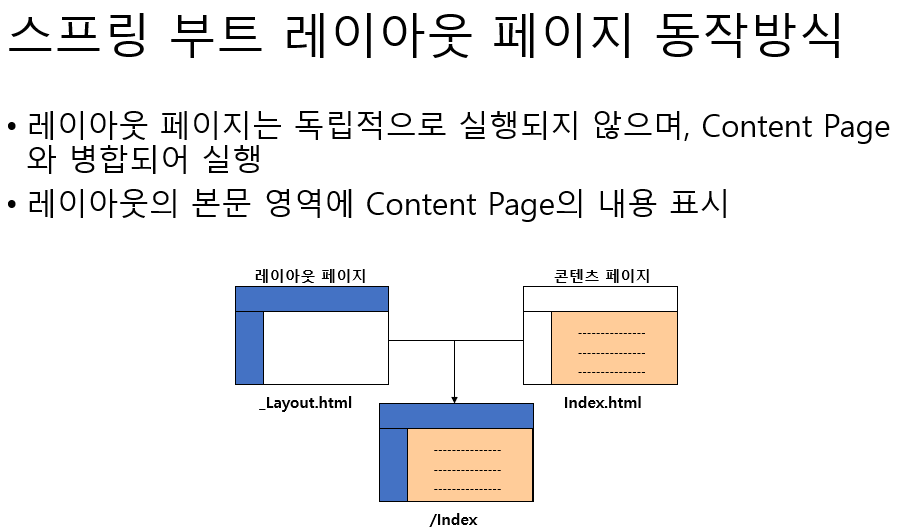

## Template Engine


## 템플릿 엔진이란?

> 데이터를 미리 정의된 템플릿에 바인딩해서 뷰의 출력을 도와주는 것이다.

이렇게 책에서는 나와있는데 사용자에게 보여줄 내용을 처리 결과 데이터를 가지고 HTML 생성해서 클라이언트에 응답을 돌려주는 역할을 한다.


### 타임리프란?
> Thymeleaf 는 HTML, XML, JavaScript, CSS 및 텍스트를 처리하고 생성하기 위한 Java 템플릿 엔진입니다.
이 튜토리얼에서는 Spring MVC 애플리케이션의 뷰 레이어에서 몇 가지 기본 사용 사례와 함께 Thymeleaf를 Spring과 함께 사용하는 방법에 대해 설명합니다 .


### 타임리프를 왜 사용할까?
- JSP는 HTML과 다소 비슷하다. 그러나 Thymeleaf와 같이 HTML과 완벽하게 호환되지는 않습니다. 우리는 Thymeleaf 템플릿 파일을 브라우저에서 정상적으로 열고 표시할 수 있지만 JSP 파일은 그렇지 않습니다.
- Thymeleaf는 Spring EL과 같은 변수 표현식(${...})을 지원하고 모델 속성에서 실행하고, 별표 표현식(*{...})은 폼 백킹 빈에서 실행하며, 해시 표현식(#{...})은 국제화 및 링크 식(@{...})은 URL을 다시 작성합니다.
- JSP와 마찬가지로 Thymeleaf는 리치 HTML 이메일에 적합합니다.


### 타임리프 기능
- 웹 및 비웹 환경 모두에서 작동한다.
- HTML5/ XML/ XHTML용 Java 템플릿 엔진이다.
- 고성능 구문 분석 템플릿 캐시는 I/O를 최소로 줄인다.
- 필요한 경우 템플릿 엔진 프레임워크로 사용할 수 있다.
- XML, XHTML 및 HTML5와 같은 여러 템플릿 모드를 지원한다.
- 이를 통해 개발자는 사용자 지정 방언을 확장하고 만들 수 있다.
- 방언이라고 하는 모듈식 기능 세트를 기반으로 한다.
- 국제화를 지원한다.

### 타임리프 특징

- SSR(서버 사이드 랜더링)
- 내츄럴 템플릿
  - 순수 HTML을 유지하며 뷰 템플릿을 사용할 수 있게 한다.
- 스프링 통합 지원
  - 스프링의 다양한 기능을 편리하게 사용할 수 있게 지원한다.
  - 스프링 부트의 기본 설정으로 `src/main/resources/templates` 폴더 아래에 `요청 핸들러 메서드의 반환값 + .html파일`이 참조된다.

그래서 웬만하면 스프링 진영에서는 타임리프를 사용하라고 권장한다. 


## Model 인터페이스


### Model 인터페이스란?

- 처리한 데이터를 뷰에 표시하고 싶을 경우 데이터를 전달하는 역할을 한다.
- 스프링 MVC에 의해 관리되며, 수동 또느느 자동으로 객체를 저장하고 관리하는 기능을 한다.
- Model을 이용하고 싶은 경우 요청 핸들러 매서드의 인수에 Model 타입 전달하여 스프링 MVC가 자동으로 Model 타입 인스턴스를 선정한다.


### 기억해야 할 중요한 메서드


- addAttribute : 특정 이름에 대한 값을 설정하고 저장하고 싶은 값에 별명을 붙인다. 뷰에서는 별명에 사용한 이름을 사용한다. 

```java
Model addAttribute(String name, Object value)
```


## 타임리프 사용법

타임리프를 사용하는 방법에는 여러가지가 있다. 하나씩 알아보자.


### 직접 문자를 삽입하는 경우

```html
<h1 th:text="Hello World">표시하는 부분</h1>
```

이런 경우처럼 그냥 "" 안에 값을 넣어서 표시할 수도 있고 타임리프의 독자적인 문법인 `${}`를 사용하여 안에 아까 핸들러 메서드에서 넘어온 model같은 값을 넣어서 사용할 수 있다.

### 인라인 처리

```html
<h1>안녕하세요! [[${name}]]</h1>
```

이런 식으로 사용하여 태그에 속성을 추가하지 않고 본문에 변수를 포함시킬 수 있다.

### 값 결합

```html
<h1 th:text="'오늘의 날씨는 ' + '맑음' ">ㅇ</h1>
```

+를 사용하여 값을 결합할 수 있고

```html
<h1 th:text="|오늘의 날씨는 ${status}| ">ㅇ</h1>
```

이런식으로 리터럴 치환을 통해 기술할 수 있다.

### 지역 변수

```html
<div th:with="a=1, b=2">
  <span th:text="|${a} + ${b} = ${a+b}|"></span>
</div>
```

이런식으로 선언할 수 있으며 정의된 태그 내부에서만 사용이 가능하다.


### 비교와 등가

우리가 알고있는 여러가지 비교 등가 연산자를 사용할 수 있다.

```html
<span th:text="1 < 10"></span>
```

이런식으로 말이다. 문자열 비교도 심지어 가능하다.


### 조건 연산자

```html
<p th:text = "${name} == 길동 ? '길동입니다.' : '길동이가 아닙니다.'"></p>

<div th:if="${name}=='길동'">
  <p>길동입니다.</p>
</div>

<div th:unless="${name}=='길동'">
  <p>길동이 아닙니다.</p>
</div>
```

if는 true일 경우 아래의 태그를 실행, unless면 false일때 실행을 한다. 제일 첫 번째의 코드는 삼항 연산자도 사용이 가능하다는 것을 보여준 것이다.


### switch

```html
<div th:switch="${name}">
  <p th:case="길동" th:text="|${name}입니다.|"></p>
  .
  .
  .
  .
  .
  .
  <p th:case="*">명부에 없는 사람입니다.</p>
</div>
```

이런식으로 switch case문 사용도 가능하다. case가 *인경우는 어떤 값에도 일치하지 않는 경우를 의미한다.


### 참조

```html
<p th:text="${mb.id}"></p>
<p th:text="${mb.name}"></p>
<p th:text="${mb['id']}"></p>
<p th:text="${mb.['name']}"></p>
```

이런 방식으로도 접근이 되고


### 참조(object)

```html
<div th:object="${mb}">
  <p th:text="*{id}"></p>
  <p th:text="*{name}"></p>
  <p th:text="*{['id']}"></p>
  <p th:text="*{['name']}"></p>
</div>
```


### 참조(List)

```html
<p th:text="*{list[0]}"></p>
<p th:text="*{list[1]}"></p>
<p th:text="*{list[2]}"></p>
<p th:text="*{list[3]}"></p>
```


### 참조(Map)

```html

<p th:text="${map.kim.name}"></p>
<p th:text="${map.lee.name}"></p>
<p th:text="${map['kim']['name']}"></p>
<p th:text="${map['lee']['name']}"></p>
```

map.key 형식으로도 참조할 수 있고, map['키'] 와 같이 대괄호를 사용해 참조할 수 있다.


### 반복

```html
<div th:each="member : ${members}">
  <p>[[${member.id}]] : [[${member.name}]]</p>
</div>
```


`th:each="요소 저장 변수 : ${[반복 처리하는 객체]}"`로 반복 처리할 수 있다. 

### 반복 상태
```html
<div th:each="member, s : ${members}" th:object="${member}">
  <p>
      index -> [[${s.index}]], count-> [[${s.count}]],
      size -> [[${s.size}]], current-> [[${s.current}]],
      even -> [[${s.even}]], odd -> [[${s.odd}]],
      first -> [[${s.first}]], last -> [[${s.last}]],
      [[*{id}]] : [[*{name}]]
  </p>
</div>
```

`th:each="요소 저장 변수, 상태변수 : ${[반복 처리하는 객체]}"`로 반복 상태도 처리할 수 있다.


### 반복 상태 변수들

| 상태 변수   | 기능 개요                                                    |
|---------|----------------------------------------------------------|
| index   | 0부터 시작하는 인덱스, 현재 인덱스를 표시한다.                              |
| count   | 1부터 시작하는 인덱스, 현재 인덱스를 표시한다.                              | 
| size    | 반복 처리하는 객체의 사이즈를 표시한다.                                   | 
| current | 현재 반복 요소의 객체를 표시한다.                                      | 
| even    | 현재 요소가 짝수 번째인지 여부를 결정한다. 짝수는 true, 짝수가 아니면 false를 표시한다.  | 
| odd     | 현재 요소가 홀수 번째인지 여부 결정한다. 홀수이면 true, 홀수가 아니면 false를 표시한다.  | 
| first   | 현재 요소가 첫 번째 요소인지 여부를 결정한다. 첫 번째이면 true, 첫 번째가 아니면 false  | 
| last    | 현재 요소가 마지막인지 여부를 결정한다. 마지막이면 true, 마지막이 아니면 false를 표시한다. | 


### 유틸리티 객체

타임리프에서는 자주 사용되는 클래스를 이라는 상수로 정의하고 있어서 그대로 변수 표현식에서 사용할 수 있다.
데이터를 출력할 때 자주 이용하는 것이 '수치', '일시', '문자열'의 포맷 변환입니다.

| 유틸리티 객체  | 기능 개요                |
|----------|----------------------|
| #strings | 문자 관련 편의 기능          |
| #numbers | 숫자 서식 지원             | 
| #bools   | 불리언(Boolean)관련 기능    | 
| #dates   | java.util.Date 서식 지원 | 
| #objects | 객체 관련 기능             | 
| #arrays  | 배열 관련 기능             | 
| #lists   | List 관련 기능           | 

### 다른 템플릿 삽입하기

프래그먼트란 단편이라는 의미이다. 다른 템플릿을 삽입하는 것이 유용할 경우가 많다. 왜냐하면 공통된 부분을 계속해서 중복적으로 코드로 작성해야하는 문제가 일어나기 때문에 만약 공통적인 부분이
있다면 그런 것들은 따로 템플릿 파일을 만들어놓고 불러오면 되기 때문이다. 그래서 이런 것들을 `fragment`라고도 부른다. 


```html
<!-- 18: 프래그먼트를 정의-->
<span th:fragment="one">하나</span>
<span th:fragment="two">둘</span>
<span th:fragment="three">셋</span>
```


```html
<!-- 18: 프래그먼트 사용하기-->
<h1>Fragment를 아래에 삽입하기</h1>
<div id="one" th:insert="fragment :: one"></div>
<div id="three" th:replace="fragment :: three"></div>
```

이런식으로 만들어놓고 나중에 가져다가 사용하면 된다.


### 레이아웃

이렇게 여러 템플릿에서 같은 디자인 레이아웃을 사용하는 경우 공통 레이아웃을 만들고 공유하는 것을 `레이아웃화`라고 말한다.
이것을 사용하기 위해서는 레이아웃 전용 라이브러리인 `thymeleaf layout dialect`를 이용해야한다.

결국 요약하면 아래 그림과 같이 동작하게 되는 것이다.

